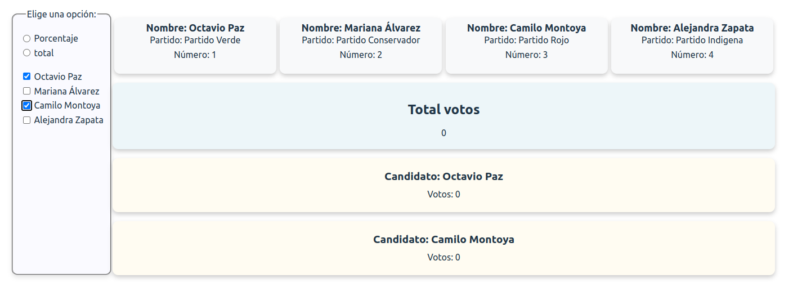

# Votes Application 🗳️  
## Table of contents :page_facing_up:
- [Overview](#overview)
  - [Installation](#Installation)  
  - [The challenge](#the-challenge)
  - [Screenshot](#screenshot)
- [My process](#my-process)
  - [Built with](#built-with)
  - [What I learned](#what-i-learned)
  - [Continued development](#continued-development)
  - [Useful resources](#useful-resources)
- [Authors](#authors)

## Overview :writing_hand:

### Installation :gear:
To get started with the project, follow these steps:

1. Clone the repository:
```shell
git clone https://github.com/viamazoba/votaciones
```
2. Navigate to the project directory:

```shell
cd votaciones
```

3. Install the dependencies:

```shell
 npm install
```
4. Start the application:

```shell
 npm run dev
```
## The Challenge :weight_lifting_man:
The main challenge of this project was to develop a web application that allows efficient management of voting for four predefined candidates. The key functionalities include:

- Tracking total votes.
- Displaying votes for each candidate.
- Allowing users to change vote percentages.

## Screenshot 📷
Here is a screenshot of the project's interface:

***Web View***



## My Process :mountain:

### Built With :hammer_and_wrench:
The project was built using the following technologies:

- React: JavaScript library for building interactive user interfaces.
- Sass: CSS preprocessor for easy and organized styling.
- useContext: Used for state management in React components.

### What I Learned :microscope:
During the development of this project, I gained experience in:

- Utilizing React to create reusable components and manage the application state.
- Applying custom styles using Sass to enhance the visual appearance.
- Using useContext for state management in React components.

## Continued Development :briefcase:
In the future, there are plans to improve the voting application with the following features:

- Implement user authentication to secure voting actions.
- Add filtering and search functionalities based on the API to facilitate product exploration.
- Enhance the user interface and user experience to make it more intuitive and appealing.

## Useful Resources :sos:
During the development of this project, the following resources were helpful:

- Official React documentation: React Documentation
- Official Sass documentation: Sass Documentation

## Authors :nerd_face:
This project was created by viamazoba,  Nataliachm and  facamesi52. You can find our GitHub profiles at the following links:

- [viamazoba](https://github.com/viamazoba)
- [Nataliachm](https://github.com/Nataliachm)
- [facamesi52](https://github.com/facamesi52)